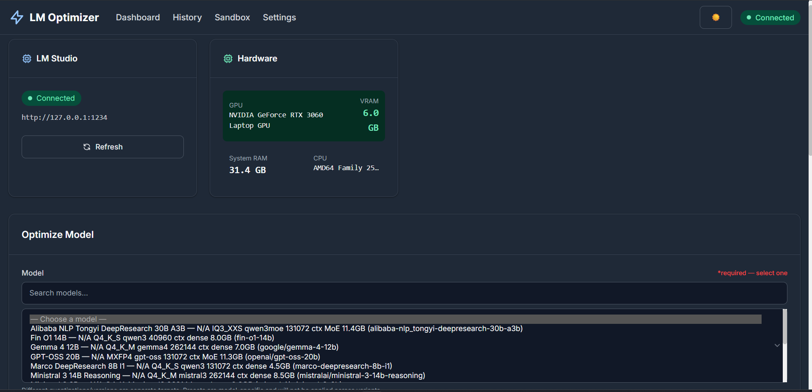
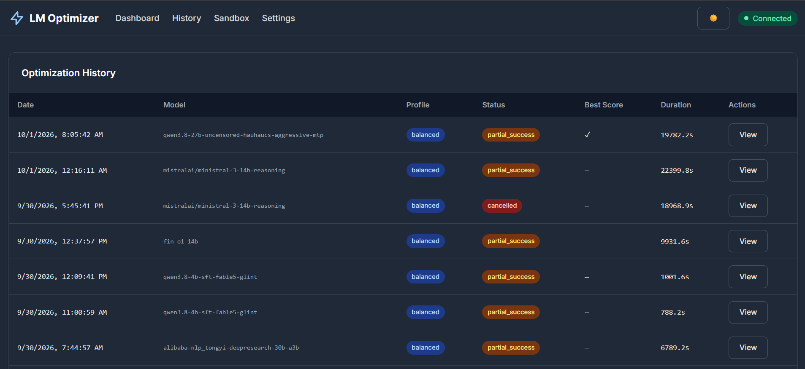
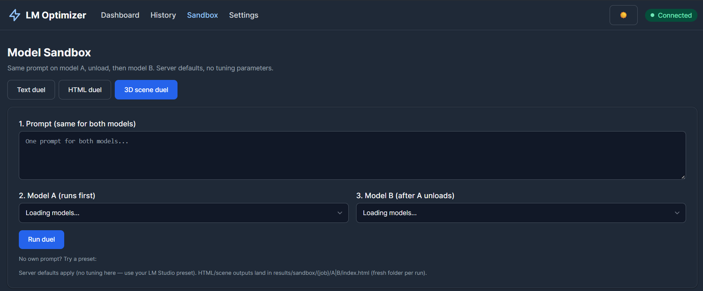
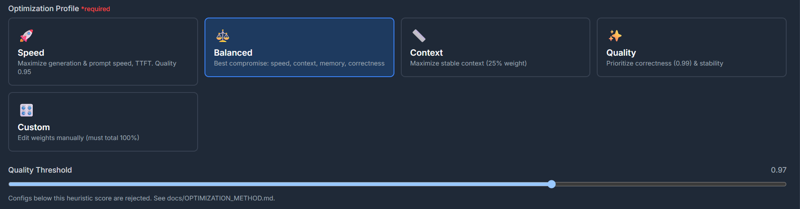
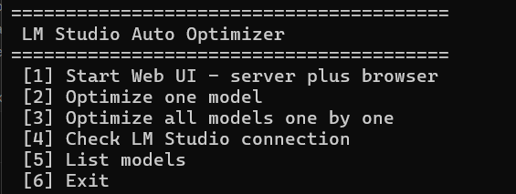

# LM Studio Auto Optimizer

Hardware-aware automatic benchmarking and runtime configuration optimization for LM Studio.
Finds empirically validated inference configurations for your hardware, model and goal —
not theoretical optima. Includes a model-vs-model sandbox (text / HTML / 3D-scene duels),
transparent results with per-test outputs, and a dark-mode web UI.

**Status: v1.1.0 working.** Speed-first search (cheap probes → quality validation on
finalists → bounded causal recovery → adaptive validation), sandbox duels with history,
Prompt/Thinking/Output transparency, OS-following dark mode, resilient Web UI.
408 automated tests green, E2E-validated on a live server + live LM Studio.

| Platform | Status |
|-|-|
| Windows | ✅ Verified (RTX 3060 6 GB host) |
| Linux | ⬜ Scripts ready (`run-web.sh`), not yet live-verified |
| macOS | ⬜ CI-tested (install + suite on macOS runner); Apple Silicon reports unified memory honestly (no fake VRAM); live run untested — testers welcome |

## Screenshots

> Screenshots land in `docs/screenshots/` (pending upload).

| Dashboard | History |
|-|-|
|  |  |

| Results | Sandbox |
|-|-|
|  |  |

| Settings | Optimization Profiles |
|-|-|
|  |  |

| CMD menu (no UI) |
|-|
|  |

## Example report (success `.md`)

Every validated run writes `results/<model>-best.md` (excerpt, host details omitted):

```markdown
# Best settings: qwen3.8-9b-distill
* Profile: balanced (style: balanced) | Elapsed: 1004.4s

## Best load configuration (REST-settable)
|Parameter|Value|Verdict|
|context_length|8192|tested (8192)|
|flash_attention|yes|verified best of tested (False, True)|
|offload_kv_cache_to_gpu (KV on GPU)|yes|verified best of tested (False, True)|
|eval_batch_size|128|verified best of tested (128, 1024, 2048)|

## Requested vs applied (winner load verification)
* Load channel: REST | Verification: MATCH

## Winner: every test explicitly
|Test|Gen tok/s|Quality|Status|
|short_instruction|22.8|1.0 (6/6)|PASS|
|medium_reasoning|32.2|1.0 (6/6)|PASS|
|long_context|30.4|1.0 (6/6)|PASS|
|coding_task|26.9|1.0 (6/6)|PASS|
|structured_output|34.2|1.0 (6/6)|PASS|
```

## Measured results (RTX 3060 6 GB, Phase-A campaign, Phase B OFF)

Validated winners (fastest quality-passing config):

|Model|Best|Speed|Quality|
|-|-|-|-|
|ministral-3-3b|ctx 32768, flash on, KV-GPU, batch 128|74.9 tok/s|1.000 (30/30)|
|qwen3.8-9b-distill|ctx 32768, flash on, KV-GPU, batch 2048|28.2 tok/s|0.983 (29/30)|
|gemma-4-12b|ctx 32768, flash on, KV-GPU, batch 2048|7.1 tok/s|0.987 (29/30)|
|gpt-oss-20b|ctx 32768, flash on, KV-GPU, batch 1024|12.1 tok/s|1.000 (30/30)|

Honest no-winners (measured, none passed quality — not config bugs): qwen3.8-4b
(structured-JSON fails), marco-8b (0.65–0.73), ministral-14b (0.60–0.68),
alibaba-30b (incl. MoE rollback). Unloadable: ternary-27b. Details in
`results/campaign/` (`INDEX.md`, `CAMPAIGN_SUMMARY.md`).

## Launchers per OS (same tree and files, only the starter differs)

**Windows** (`.bat`):

```bat
start_optimizer.bat          REM primary Windows launcher (menu: Web UI, checks, models, benchmark, optimize)
run-all.bat                  REM utility: everything overnight (tests + tuning + ceilings)
run-model.bat <key> [ctx]    REM utility: one model
run-model.bat ALL [ctx]      REM utility: all models one by one (small first)
run-web.bat                  REM utility: web UI on http://127.0.0.1:8080
```

**Linux** (`.sh`, macOS uses the same scripts — untested):

```bash
chmod +x run-web.sh run-optimizer.sh
./run-web.sh                 # web UI on http://127.0.0.1:8080
./run-optimizer.sh status    # CLI passthrough, e.g. ./run-optimizer.sh models
./run-optimizer.sh auto      # all models one by one (small first); --skip a,b to skip
```

> macOS: same `.sh` launchers are expected to work (Metal detection is coded,
> `lms` CLI optional) but no Mac has run them yet — report back if you try.

Prerequisites (both): LM Studio running with Developer server on `127.0.0.1:1234`,
KV cache quantization **Q4 starter** + CPU threads at logical maximum (both GUI-only,
REST cannot set them — verified). **Keep Model in Memory must be OFF** during runs —
otherwise unloads do not take effect and the run stops fail-closed (see Troubleshooting §11).
See `python -m lm_optimizer recommend --vram 6`.

Manual install:

```bash
pip install -e ".[dev]"
cp .env.example .env    # Windows: copy .env.example .env
python -m pytest -q
```

## CLI reference

|Command|What it does|Live load?|
|-|-|-|
|`status`|connection + probed capabilities + hardware|probe only|
|`models`|list local models (size, quant, ctx, MoE)|probe only|
|`inspect <model>`|model detail + supported params|probe only|
|`recommend --vram 6 [--estimate]`|fit table + GUI/host checklist (+ `lms` estimates)|no|
|`benchmark <model> --context N --style S`|5-test suite, one config|yes|
|`optimize <model> [--dry-run] [--profile P] [--resume ID]`|Phase-A tuning + preset + report|yes|
|`compare <model> --config-a A --config-b B [--tests T]`|A/B configs on the same tests|yes|
|`auto [models] [--skip X,Y]`|smoke → precision → ladder → matrix → optimize|yes|
|`fit [models]`|max-context ladder per KV path|yes|
|`ctx <model>`|geometric context sweep + bisect|yes|
|`pause <id>` / `resume <id>` / `run-status`|graceful pause + resume under same ID|no|
|`checkpoints`|list interrupt checkpoints|no|
|`param-matrix [--record]`|parameter control matrix (+ DB snapshot)|no|
|`apply / restore / presets / runs`|presets and history management|apply/restore yes|
|`cleanup_test_runs`|remove test runs|no|
|`python hw_monitor.py [--model M]`|VRAM/RAM/swap snapshot; optional tok/s probe|only with `--model`|
|`python vram_matrix.py <model>`|12-config ctx×flash×KV fit/speed matrix|yes|

Benchmark styles: `precise` (code/math temp 0.1), `balanced` (suite defaults),
`creative` (summarization temp 0.9). Every command first unloads stale models and
verifies empty state; every load/unload is server-state verified.

## Web UI

```bash
python -m lm_optimizer.web_main   # http://127.0.0.1:8080
```

Pages: **Dashboard** (optimize form, live status), **History** (runs + sandbox duels,
config counts, stale flags, delete/abandon), **Results** (winner card, alternatives,
charts, per-test Prompt/Thinking/Output, full JSON page), **Sandbox** (text/HTML/3D
duels with presets), **Settings**. API under single `/api` prefix + websocket progress.
Dark mode follows the OS (toggle in nav). Read endpoints are load-free and degrade
gracefully when LM Studio is down.

## How it works (Phase-A strategy)

```
PREPARE → SPEED (fixed small ctx) → FRONTIER → QUALITY (frozen finalists)
  → RECOVERY (bounded rollback) → FINAL VALIDATION → [optional] CONTEXT
```

1. **Prepare**: unload-all, snapshot free VRAM/RAM/swap, verify empty, detect hardware.
2. **Speed**: cheap probes (one short prompt, ≤64 tokens) over high-impact levers at a
frozen context; adaptive budget from the S0 measurement (fast models 3 reps, slow 1).
3. **Frontier**: 5% non-inferiority band + one contrarian candidate.
4. **Quality**: only finalists run the full 5-test suite at the frozen quality context.
Raw fastest is tracked even when it fails; the winner is the fastest quality-passing
config. Failed loads never score, never win.
5. **Recovery**: reconfirm failed tests, then roll back ONE suspect in tier order
(speculative/MTP, experts, KV → placement, flash → batches), bounded to 3 probes.
6. **Final validation**: adaptive 2–5 reps from stability; median wins.
7. Optional Phase B (`--optimize-context`): max-context sweep on the frozen winner.

Quality gate: 6 heuristic checks × 5 tests (JSON, code, instruction, reasoning,
context). Benchmarks run `reasoning="off"` (auto-omitted where unsupported); empty
outputs fail loudly. Reasoning traces are preserved separately (`thinking_text`)
and shown per test, never mixed into answers.

Reports: preset saved + per-model `.md` + campaign exports in `results/campaign/`.
Sandbox duels persist in their own history (never mixed with optimization runs).

## Verified LM Studio contract

Live-verified. Unknown keys 400 **without loading**, so capabilities probe safely and
adapt per version (results cached per server, warmed at startup).

**Load** (`POST /api/v1/models/load`, flat params): `context_length`,
`flash_attention`, `offload_kv_cache_to_gpu`, `eval_batch_size`,
`physical_batch_size`, `parallel`, `context_checkpoints`,
`reasoning_budget_message` (string), `num_experts` (MoE), full
`speculative_draft_*` family, `echo_load_config`. Requested-vs-applied is
compared on every load (mismatches recorded, never silent).

**Rejected via REST** (400): `gpu_ratio` (use `lms load --gpu`), `rope_*`,
`keep_model_in_memory`, `try_mmap`, `seed`, `n_threads`, KV-quant types,
`unified_kv_cache`, `ttl`, `num_layers`, `gpu`.

**Chat** (native `POST /api/v1/chat`, `input` string): `temperature`, `top_p`,
`top_k`, `min_p`, `presence_penalty`, `reasoning` (model-dependent sets!),
`max_output_tokens`.

Details: `docs/PARAMETERS.md`, generated `docs/LM_STUDIO_PARAMETER_MATRIX.md`
(`scripts/generate_parameter_matrix.py`), `lm_optimizer/services/parameter_registry.py`.

## Hardware notes

* Designed hardware-agnostic (no hardcoded GPU): NVIDIA/CPU paths, ASCII output,
graceful degradation without `nvidia-smi`/psutil. Live-tested on RTX 3060 6 GB;
CPU-only paths are coded and unit-tested, not physically exercised.
* Remote LM Studio is detected and warned: local hardware must not score it.
* Timeouts scale with model size (loads 600 s, generations scale with max tokens).

## Development

```bash
pip install -e ".[dev]"
python -m pytest -q                       # 408 tests
python scripts/generate_parameter_matrix.py
```

## Project structure

```
lm_optimizer/
  api/          FastAPI app, routes (single /api prefix), schemas, websocket
  benchmark/    suite (5 fixed tests) + runner (native chat)
  cli/          commands (status..param-matrix, incl. compare/pause/ctx/resume)
  database/     SQLite + migrations (runs, duels, capability snapshots)
  discovery/    model inspection
  domain/       dataclasses (LoadConfiguration filters to server-supported keys)
  hardware/     detection (GPU/CPU/RAM, Windows/Linux/macOS branches)
  optimizer/    legacy engine (deprecated, see services/optimizer.py)
  profiles/     speed/balanced/context/quality weights
  scoring/      normalization + heuristic evaluator
  services/     clients, benchmark, search space, optimizer, matrix, fit,
                context_sweep, selection, preheat, workload, run_summary,
                reporting, recommendations, generation defaults, hostguard,
                lms_cli, parameter_registry, speculative, compare, sandbox
  storage/      checkpoints
  ui/           templates + static JS (dark mode, status poller, duel UI)
hw_monitor.py vram_matrix.py run-*.bat run-*.sh scripts/ docs/ results/ (gitignored)
```

Runtime data (`data/*.db`, `logs/`, `results/`) is gitignored and
never pushed. No credentials exist in the repo (only `LM_STUDIO_URL` default).

## License

MIT — see `LICENSE`.
```

(End of file)
